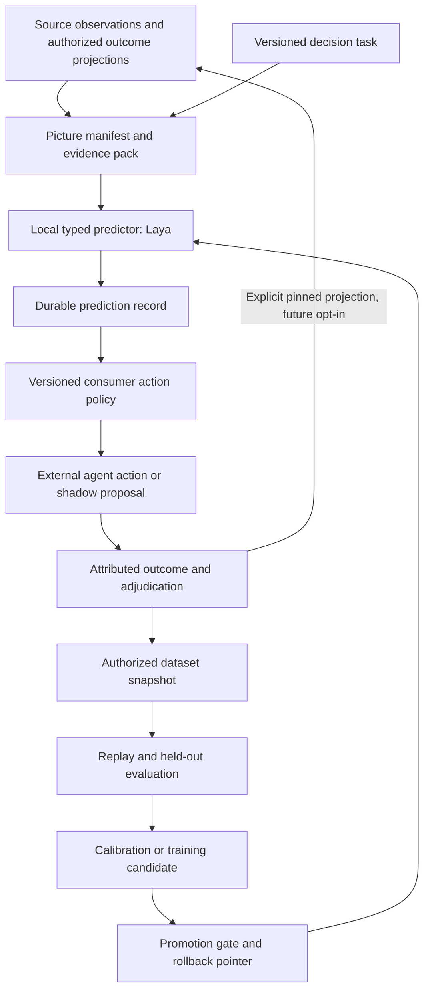

# Local decisions over a measurable operational picture

Status: proposed architecture and implementation plan, 2026-09-29. This document
specifies new behavior; the local validation report records what was actually
exercised. No production decision API or PR-review feature is introduced here.

## Objective and boundary

Shoal should let an agent make an inexpensive, bounded decision using an
operational picture, retain the evidence and outcome, and improve the decision
through measured changes to evidence selection, calibration, and model weights.
Laya is the first local predictor. The first consumer is an external agent
showcase that triages Go authorization-boundary changes in Shoal pull requests.

The graph is a snapshot of observations, not a claim to complete knowledge.
Its utility must be measurable even when collection is partial, references are
unresolved, or evidence is stale. A structurally valid graph is not necessarily
a correct description of the world, and a valid prediction is not necessarily
a correct decision.

Shoal owns general task contracts, authorized evidence assembly, prediction and
outcome records, dataset manifests, evaluation records, and model promotion.
The showcase owns GitHub collection, Go analysis, reviewer orchestration,
reproduction tests, and presentation. GitHub and peer-review concepts do not
enter the decision core. No PR approval or merge workflow is added to Shoal.

The first rollout is shadow-only: full review continues while local decisions
are measured. Shadow scores/proposals remain hidden from the full reviewers
until their outcomes are sealed; record any exposure that breaks blinding. Later exclusion is scoped to the task whose quality was evaluated.
Authorization triage alone never excludes a change from concurrency, correctness,
or all-purpose review.

## Existing seams and gaps

| Existing code | Reuse and constraint |
| --- | --- |
| `pkg/inference`: `EvidenceAnchor`, `ContextPack`, model/prompt provenance | Exact evidence and snapshot/authorization pins. A new typed predictor must not pretend to generate free-form claims. |
| `pkg/contextpack`: `Builder`, `OpenSection`, `ExpandNeighbors` | Bounded authorized hydration and evidence construction. Add measurement alongside the pack, without changing its existing identity rules. |
| `pkg/explorer/bounded.go`: `refreshSnapshotLocked`, `ValidateEvidenceSnapshot` | Snapshot is content equality. Identical recurring state reuses the historical `AsOf`; the frontier is not a temporal sequence. |
| `pkg/code`: `Parse`, `ParserProvenance`; `pkg/explorer/codematerializer` | Parser-neutral symbols, references, source ranges, and materialization. There is no shipped Go parser/callgraph adapter to assume. |
| `pkg/interaction`, harness `GraphRecorder` | Source-derived visibility and redacted execution records. Existing recorder payloads must remain redacted. |
| `pkg/explorer/fleet`: `ActionRecord`, `ActionExecutor`, external completion | Dispatch, idempotency, claims, and execution receipts. Execution success does not establish prediction correctness. |
| `pkg/explorer/authorized/accumulator.go` (#397) | Windowed state for an eventual control; distinct from per-example prediction and learning records. Mosaic storage must remain unchanged. |
| `pkg/model`: `TextGenerator`, `CacheIdentityProvider` | Provider boundary and cache-identity patterns. Laya requires its own typed inference contract. |

Interaction nodes are intentionally excluded from the source snapshot. Recording
an outcome therefore does not automatically revise the graph used by a future
decision. A later decision must explicitly include a pinned, authorized outcome
projection in its picture manifest. Predictions remain marked as predictions;
neither their repetition nor their graph presence turns them into source facts.

## Serving and learning loops

The synchronous path constructs evidence, predicts, records, and returns a
receipt. The learning path assembles authorized examples, evaluates candidates,
and explicitly promotes a release. Live traffic does not mutate serving weights.
A missing or failed predictor yields an unavailable/abstain outcome for the
consumer's fallback; it never supplies a fabricated low-risk result.

## The picture manifest

An immutable `PictureManifest` accompanies a context pack. Its content-derived
identity pins all decision-relevant inputs, including the measurement method.
At minimum it contains:

- Source snapshot ID and its existing `AsOf`, plus the authorization fingerprint.
- Observation run ID, observation/acquisition times, and decision availability
  cutoff. Source event time and Shoal receipt time are distinct. Freshness is
  measured from a recorded observation or source watermark, not snapshot `AsOf`.
- Immutable source revisions/digests and extractor, parser, ontology, and
  evidence-builder versions and configuration.
- Requested scope, discovery method, enumerated input manifest, and measurable
  coverage: numerator, denominator, units, and method. Unknown denominators
  remain unknown; a fraction of one never proves global completeness.
- Extraction failures, unresolved references, stale observations, missing inputs,
  unsupported constructs, and bounds reached. Diagnostics visible to a caller
  must not disclose the existence of unauthorized objects.
- Exact evidence-anchor IDs and input serialization digest, tokenizer identity,
  effective token budgets, preflight token counts, and truncation disposition.
- Origin and author-control classification for evidence. PR descriptions, review
  prose, identifiers, and comments are untrusted inputs; source text cannot
  redefine tasks or reviewer instructions.
- Explicit identities of any authorized outcome projection used as input. Such
  projections are excluded from the first showcase; future opt-in requires
  as-of label versions, receipt cutoff, and exclusion of the current example
  family and held-out data from the projection.

For the showcase, enumeration starts with **all changed files and declarations**
between pinned base/head trees. Changed functions are one analyzed subset.
Package variables/constants, type/interface changes, build tags, module manifests,
policy/config files, tests, generated code, additions, deletions, and renames all
receive a disposition. Unsupported items cannot disappear into a misleading
100% function-coverage number. A zero denominator is reported as not applicable,
never complete. Explicitly out-of-task items are distinguished from unanalyzed
potentially relevant items; the latter make exclusion ineligible.

The collector supplies a pinned enumeration manifest and raw file-level diff.
Shoal verifies every enumerated item has evidence or an explicit disposition and
computes the measured numerator. A second file-level comparison detects omissions
from declaration discovery; this still measures coverage of the declared source
scope, not all possible dependencies. Reference resolution has its own denominator
and unresolved counts. Retain disagreements between enumerators.

Each task defines evidence eligibility requirements. Incomplete pictures can be
useful for prioritization; a picture failing those requirements is ineligible for
exclusion. If necessary evidence exceeds a bound, request a separately recorded
expansion or escalate. Silent tokenizer truncation cannot authorize exclusion.

A new observation can have the same source snapshot and a different picture
manifest. Evaluation must be able to distinguish an extraction improvement from
a model improvement: compare models on the same picture, and builders with the
same model. Both are legitimate interventions and have separate version IDs.

## Provider-neutral records

Proposed package: `pkg/decision`. Names below describe contracts, not existing
exported API. Constructors follow the existing immutable, bounded-value patterns.

| Record | Required content |
| --- | --- |
| `TaskSpec` | Owner/scope, immutable ID/version, typed questions and permitted labels or ordered rubric, input schema, evidence requirements, label rubric, authorized labeler roles, prediction/label/action units and aggregation rule, task-specific loss and evaluation slices. Definitions come from trusted task owners, not source comments. |
| `DecisionRequest` | Task version, picture and context-pack IDs, subject/authorization pins, consumer correlation, deadline and explicit resource bounds. |
| `PredictorIdentity` | Provider/runtime version, immutable weights and tokenizer revisions/digests, input formatting/configuration, numeric precision/device policy, batch/padding policy, environment lock digest, and calibration identity. A friendly model alias is insufficient. |
| `PredictionRecord` | Request/evidence identities, answer distributions, typed values, abstention or failure, effective device, latency/usage, prospective/reconstructed provenance mode, and exact predictor identity. No assertion that probability equals correctness. |
| `ActionRecord` reference / `ActionProposal` | Separately versioned consumer policy, prediction receipt, chosen action, shadow/live mode, fallback reason, and eventual execution receipt. Shadow proposals have no external effect. |
| `OutcomeRecord` | Original decision/action refs; observed proposition; proposed/confirmed/disputed/unresolved status; server-authenticated submitting principal and separately client-asserted agent/reviewer/test identities; supporting evidence; source event and receipt times; supersedes link for corrections. |
| `DatasetManifest` | Exact authorized example refs and label versions, collection policy and selection propensity, related-example group IDs, temporal cutoff, split assignments, licenses/usage constraints, retention references, prospective/reconstructed mode, and content digests. |
| `EvaluationRecord` / `ModelRelease` | Dataset/split, task, builder, predictor, calibration and policy versions; metric definitions/counts/uncertainty; promotion decision; immutable artifact refs and rollback target. |

Start with `choice`, ordinal `score`, and proposition probability, with a
provider-independent abstention disposition. Validate exact question membership,
answer-label membership, finite numbers, ranges, distribution normalization,
ordered-rubric identity, and returned model identity. Preserve native rounded
probabilities and validate their sum within the pinned provider's explicit
rounding bound; never silently renormalize malformed output. Distinguish Laya's
entropy-derived `confidence` from `answer_confidence` and proposition probability;
none is calibrated for this task until evaluated. Missing answers, malformed
responses, unknown tasks, and unpinned revisions fail closed as contract errors.
Abstention, timeout, transport failure, and negative prediction stay distinguishable.

Predictions and outcomes are append-only events with idempotency keys. The
serving key binds a canonical request, not potentially nondeterministic model
output. Look up and reserve the request before inference; serialize concurrent
retries. A committed retry returns its original receipt. A different request
under the same key conflicts. A crash after inference but before commit may
require recomputation, but only one result can become the committed receipt.
A pending lease/recovery state makes uncertain requests observable. Outcome event
keys similarly bind the submitted event, not a mutable derived label. A corrected label supersedes a prior label rather than overwriting the
original. The serving policy/model version is resolved once per request, so a
concurrent promotion cannot produce a mixed-version receipt.

Recorded replay resolves exact retained artifacts and receipts. Recomputed replay
uses a recorded numerical tolerance and label-level comparison, not a promise of
bitwise equality across GPU implementations or batch shapes.

A prediction-dependent optimization such as exclusion requires a durable
prediction receipt. The predeclared conservative fallback (ordinary full review)
remains available if prediction or recording fails; attempt to record the fallback
when possible, without manufacturing a successful prediction receipt. Partial failures preserve committed/indeterminate status; retries must not
claim rollback. A later action/outcome can be reconciled by receipt and execution
identity. Reuse fleet dispatch when scheduling work; do not hold a storage
transaction open across an external model call or agent action.

Cache identity includes task, exact serialized evidence/picture, authorization
and source pins, predictor, calibration, and effective runtime parameters. Cache
hits still produce decision receipts and require current authorization. Record
reuse for an identical replay is separate from a new observed serving event.

## Storage, access, and public surface

Use Shoal's existing engine and authorized catalog patterns for new versioned
record families. Do not overload `CoOccurrenceRecord` or change its codec.
Persist record envelopes with explicit schema version, bounded fields, checksums,
idempotency/conflict semantics, and restart recovery. Graph projections contain
references, typed bounded facts, provenance, and visibility—not unrestricted
copies of source text or model prompts.

Current authorization applies to picture construction, record reads, historical
rehydration, outcome submission, and dataset export. Historical possession is
not present permission. Source-derived records inherit the conjunction of all
inputs' visibility, including evidence used to produce a label. A client unable
to access the complete input cannot receive a revealing prediction, coverage
count, label, or diagnostic through a supposedly harmless metadata endpoint.

Submitting an observation is distinct from adjudicating a training label. A
server-set principal and receipt time are authoritative; reported model/prompt
identities remain asserted unless a trusted executor attests them. A task names
which roles may propose, challenge, and adjudicate labels. Dataset selection
accepts only eligible adjudications and enforces separation from the case author
or decision subject for the showcase. Storage administrators are trusted;
checksums provide corruption detection, not independent tamper attestation.

Training/export is a distinct authorized operation, not implied by a read grant.
Keep raw replay/training material in explicitly authorized source/artifact storage
with retention and content identities. The redacted `GraphRecorder` cannot be
re-associated with raw prompts to manufacture a training dataset. If evidence
has expired or been revoked, replay reports unavailable rather than quietly
substituting current content. Dataset retention references hold the required
source revisions and artifact manifests for the evaluation period, subject to
revocation/deletion policy. A graph snapshot ID alone does not promise retained
historical bytes. Builder comparisons use only retained observations available
at the original cutoff and the intersection of original authorized scope and
current permission. A fingerprint alone cannot reconstruct that scope; retain an
authorized original evidence/source manifest or trusted proof. Report cases
ineligible for builder replay separately.

A model trained on restricted data is itself a derived artifact with a recorded
dataset lineage and distribution policy. Shared base weights are the default;
repo/task specialization is introduced only by evaluation and compatible access
policy. Calibration artifacts and learned thresholds also have dataset lineage.
Revocation/tombstone propagation marks affected datasets/releases ineligible for
new use pending an explicit retention/retraining decision; deleting a source does
not claim to remove its influence from already trained weights.

Proposed authenticated API operations are register task, evaluate decision,
read authorized receipt, attach outcome, snapshot/export dataset, record evaluation,
and promote release. Resolve tasks and releases server-side; callers cannot
supply arbitrary weight paths, override device/egress policy, or access a raw
unbounded predictor proxy. Add HTTP/SDK adapters after core/store conformance.
No endpoint contains `pull_request`, `github`, or a peer-review lifecycle.

## Local Laya worker

Use a long-lived Python worker on the developer machine or in the deployment,
behind a typed Go adapter. Upstream exposes `POST /v1/systemone` and `/health`.
The adapter pins a checkpoint explicitly; language auto-routing is not an
appropriate implicit model selector for source code. Serving identity includes
weights, tokenizer, criteria, preprocessing, calibration, and runtime settings.

Provision model artifacts before serving, verify digests, and run inference
without network access to model hubs. Local loopback and a deployment-private
worker have distinct resolved egress postures; remote placement is not magically
local because it uses the same protocol. GPU-required and explicitly allowed
CPU modes are deployment settings. Report actual device and fallback events;
benchmark queueing, cold load, batch shape, and warm inference separately.

The adapter enforces bounded request/response sizes, token preflight on the exact
state/question serialization, deadlines, concurrency, health/readiness, explicit
checkpoint identity, and valid typed results. Unknown model aliases must be
rejected even if upstream auto-routes them. Both state and answer-option budgets
matter: option text can collapse under truncation. Inspect upstream effective
usage, but do not equate token usage with proof that all required evidence was read.

A thin worker wrapper may be required to expose exact preprocessing/tokenizer
preflight, artifact manifests, and typed failure metadata missing from upstream.
That gap is part of the adapter issue, not a reason to weaken the contract.
Runtime completion on synthetic snippets demonstrates integration only; it does
not establish authorization-analysis accuracy or useful confidence thresholds.

## PR-triage showcase: external agents

Keep the executable integration under a separate showcase/tooling boundary
(proposed `showcases/pr-triage/`), with no GitHub dependency in `pkg/decision`.

1. Collect Shoal PR base/head commits and time-bounded GitHub observations.
   Capture exact revisions, pagination/collection failures, provenance, and
   edit/supersession timestamps. A current API response is not proof of what was
   available historically; missing historical state is explicit.
2. Parse before/after Go using an explicit Go adapter. Start with `go/parser` and
   bounded symbol/reference extraction; use `go/types` only with recorded build
   context and controlled dependency resolution. Dynamic dispatch, unresolved
   imports, build tags, generated code, and cross-language paths stay visible as
   limitations. Never execute untrusted PR build hooks to collect a graph.
3. Assemble changed-function evidence, affected checks/invariants, direct callers,
   and required supporting code. Independently enumerate the changed-function
   manifest so selective retrieval cannot hide omitted candidates from coverage.
4. Run the versioned task `go.authorization-boundary-triage/v1`: does this change
   affect an authorization boundary and require deeper authorization review?
   Relevant mechanisms include checks, tenant/object scoping, filters before
   retrieval, delegation, and fail-closed errors. Separate boundary-relevance
   labels from confirmed-defect labels; relevance accuracy is not defect recall.
   The prediction/label unit is a changed declaration with its bounded dependency
   neighborhood, plus explicit file-level units for unsupported constructs. The
   action unit is the PR's authorization-review evidence bundle. A versioned
   aggregation rule retains every relevant, abstaining, or ineligible unit and
   its dependencies; any unsupported possibly relevant file forces full
   authorization review. Evaluate retention at the PR/fix-family action unit.
   For MVP, all units are reviewed regardless of the shadow proposal.
5. Record local predictions and shadow review-selection proposals. Full review
   continues unchanged. A prediction of low relevance is not a clean bill of
   health, and never skips other review tasks.
6. Run blinded frontier assessment with no access to Laya's scores or proposed
   selection. A second reviewer, optionally local Claude CLI as a hosted-model
   client, challenges each finding and seeks counterexamples. Reviewer model,
   version, prompt, visible evidence, and tools are recorded. Different model
   families are preferable; same-family correlation is explicit. Also challenge
   a randomized sample of negative/no-finding cases—including cases both Laya
   and full review dismiss—to search for missed authorization-affecting paths.
7. Verify with a bounded reproducer, regression test, or concrete evidence-backed
   path. A relevance label follows an explicit rubric: a traced change to a
   trusted authorization-surface inventory, a scope/filter predicate, delegation,
   or deny/allow flow. Record the witness path and criterion; inventory absence
   is not proof of irrelevance. Authorized adjudicators validate these witnesses
   and a random sample of negatives. Defect confirmation is separate: a test
   must have a rubric-valid oracle and reproduce the regression on head while
   passing on base or a verified fix (or record why only a concrete path applies).
   Agent consensus alone cannot confirm a label; unresolved cases remain
   unresolved and can be escalated to a human. PR approval/merge and an absence of
   comments are not validated negatives.
8. Attach adjudication outcomes using general Shoal contracts. Code execution
   occurs in an isolated test runner without repository credentials or network
   by default. Fetch pinned modules in a separate non-executing provisioning
   stage with checksum verification; execute PR code, including init/TestMain,
   only inside the isolated runner with the prepared cache and resource bounds.
   An agent-written test whose oracle is unverified remains proposed.
   Frontier calls are explicit egress-bearing actions; local Laya
   inference and hosted reviewer calls have different policies and costs.

PR prose is excluded from the initial Laya input. Source comments and identifiers
remain author-controlled and receive that provenance; both local and frontier
prompts treat source text as evidence, never instructions. Before exclusion,
evaluate misleading/comment-stripped variants and changes split across PRs.
Deterministic checks and unsupported-input fallback remain active regardless of
model confidence. No claim of prompt-injection resistance follows from typed output.

The frontier reviewer may need broader authorized evidence than Laya to discover
missing context. Record both evidence manifests. Its later findings belong on the
outcome side of a replay, never in the original prediction input. Corrective commits,
future review comments, incident reports, and fixed code must not leak across that
boundary. Models, review history, and pretraining can still correlate; report this
limitation and include temporally held-out new examples and independent tests.

## Measurement and promotion

Measure three different things, each with counts, population scope, method, and
uncertainty:

| Dimension | Examples |
| --- | --- |
| Picture quality | All changed items accounted for / enumerated; eligible functions collected / enumerated; parse success / attempted; reference resolution / extracted references; freshness by source; unknown denominator and truncated-input counts. |
| Decision quality | Boundary-relevance precision/recall; independently confirmed authorization findings retained; abstention/eligible coverage; calibration and false-negative rates by task slice and picture quality. |
| Operational value | Observed full-review tokens and measured replay-subset tokens, repeated context/retries, frontier calls, GPU time, p50/p95 latency, adjudication labor and amortized tuning cost. Shadow savings are counterfactual; realized savings start only in canary operation. |

Evidence-containment recall and downstream finding-detection recall are separate.
Before canary, run blinded paired full-context and proposed-subset frontier reviews
on held-out cases, independently adjudicate what each actually detects, and record
all extra retrieval, tool calls, retries, and tokens. Repeat according to the frozen
protocol to characterize reviewer variability. Merely retaining a finding's file or
counting a smaller prompt is insufficient to establish useful review savings.

Use repository/PR/fix-family grouping and temporal splits for train, calibration,
validation, and final test. A final test is not available for prompt selection,
threshold fitting, label-policy tuning, or weight updates. Refresh a prospective
holdout after repeated release decisions would otherwise tune to it. Public
historical cases and injected faults are useful development data, not proof of
independence from either the frontier models' or Laya's training corpora. Retrospective reconstruction
and prospective collection are separate cohorts; only cases received after the
pinned model release, collected prospectively with sealed inputs, qualify for
that release's final prospective evaluation. Do not trust author-controlled Git
timestamps as proof of availability. Dedupe by content/evidence digests as well
as PR/fix-family groups, including cherry-picks, reverts, and backports. Never count multiple correlated
hunks of one bug as independent evidence of recall.

Pre-register audit strata/probabilities before scoring and record the realized
selection, including conditional sampling of negatives. In shadow mode,
full review supplies a comparator with unknown recall, not ground truth; label
its finding-retention metric as relative to full review. Use independently seeded
authorization regressions to measure comparator sensitivity before exclusion,
reporting their artificial distribution separately from operational cases; after exclusion, randomly audit excluded
cases and separately oversample disagreements/rare cases for discovery. Keep
sampling strata and propensities so biased discovery data cannot masquerade as
population-wide quality. Preserve unknown and disputed outcomes in denominator
reports, but do not turn them into clean negatives or supervised labels.

Before collecting the evaluation cohort, freeze a protocol with the task/units,
cohorts, baselines, splits, label/adjudication rules, sampling plan, primary metrics,
fixed evaluation horizon, and a go/no-go decision rule. For the first shadow report,
the required outcome is a complete, uncertainty-qualified comparison; it may conclude
that Laya adds no value or that exclusion is not evaluable on Shoal alone. Continuing
toward exclusion requires better finding/relevance retention at matched review
reduction than the best simple baseline, with the predeclared statistical test.

The protocol must distinguish misses per audited excluded action from misses per
confirmed positive case (one minus recall); their denominators differ. It records
an owner-approved target, confidence level, expected positive count, required
sample size, and achievable collection volume before any exclusion experiment.
No numeric exclusion target is approved by this architecture. If independent
positive cases are too sparse, remain in shadow and report insufficient evidence
rather than inventing confidence. Do not repeatedly peek and apply a fixed-horizon
confidence gate without a predeclared sequential method.

No default confidence threshold or exclusion percentage is declared safe. Each
release needs an explicit task-scoped loss budget and minimum evidence volume,
including a one-sided upper confidence bound on missed actionable findings. Zero
misses in a small sample is not sufficient. Report uncertainty at the PR/fix-family
level and the number/severity of independently confirmed findings. The first
milestone has no exclusion gate to pass; its job is to measure whether one is
plausible and compare Laya to simple static/path-based baselines.

Promotion stages are recorded: shadow, task-scoped canary exclusion with audit,
and broader task-scoped exclusion. Missing runtime/recording, insufficient picture
coverage, failed quality gate, stale calibration, or drift returns the consumer
to full review. Before canary, instantiate each trigger: maximum calibration
age/example count, named drift statistics and thresholds, audit cadence, and a
maximum number of promotion evaluations per holdout. Undefined triggers prohibit
canary promotion. An operator can roll back an immutable release pointer. The
runtime revision cannot change under a release alias without a new evaluation.

Retuning has three separately evaluated interventions: evidence/task changes,
calibration/action thresholds, and weight fine-tuning. Export an immutable dataset;
train offline; retain artifact/dataset lineage; evaluate on untouched cases; shadow
the candidate; promote deliberately. Synthetic and frontier-proposed labels retain
origin/status and are reported separately from verified operational outcomes.

## Dependencies and delivery order

The generic decision subsystem is not blocked on completion of #389 or #388.
It supplies predictions and outcomes; admission authority and accumulated risk
remain their own controls. #397 provides a reusable accumulator but does not store
training examples or make probabilities into attributable risk contributions.

The external-executor completion path landed in #394. Shared/private deployments
must account for #369 (fleet evidence visibility), #398 (absent versus foreign
principal disclosure), and #370 (descriptor scope). #385 supplies effect/egress
classification and #388 supplies pre-call admission for managed external actions.
A public-repository, read-only local showcase can proceed without claiming those
shared deployment controls are implemented. The first showcase is single-principal
and public-source. For protected pictures lacking complete input authorization,
return only unavailable, without revealing denominators or missing-item counts;
shared/private deployment is not validated by the public showcase. Protected hosted reviews and training
exports require the appropriate authorization/egress controls first.

Implement in independently reviewable increments:

1. Task, picture-measurement, and typed prediction contracts plus conformance.
2. Durable authorized predictions/actions/outcomes and general API adapters.
3. Pinned local Laya worker adapter and device/health/token conformance.
4. Authorized dataset snapshots, temporal replay, and evaluation metrics.
5. Offline calibration/fine-tuning candidates, promotion, and rollback.
6. External GitHub/Go collector with independently measured extraction coverage.
7. External independent/challenger/reproducer agents and attributed outcomes.
8. Shadow showcase, simple baselines, end-to-end report, and explicit later
   exclusion gate. Serving integration alone is not completion of this step.

The first runnable slice combines 1–4 and 6–8 in shadow mode using the published
checkpoint. Fine-tuning is a follow-on after the baseline exposes a repeatable
gap and enough verified examples exist. A generic contract conformance test uses
a second synthetic non-code task to prove no GitHub/PR assumptions entered core;
this is not a second product integration or a model-quality benchmark. A package
boundary test also rejects core dependencies on GitHub clients, showcase packages,
or Go parser/type-checker packages.

## Validation and tracking

See [local validation](local-decisions-validation.md) for pinned upstream source,
runtime/model identities, exact checks, results, and limitations.

Roadmap: [#401](https://github.com/phrocker/shoal-oss/issues/401). Architecture and probe: [draft PR #400](https://github.com/phrocker/shoal-oss/pull/400).

| Issue | Deliverable | Implementation dependencies |
| --- | --- | --- |
| [#402](https://github.com/phrocker/shoal-oss/issues/402) | Typed tasks and measurable picture manifests | — |
| [#403](https://github.com/phrocker/shoal-oss/issues/403) | Authorized durable predictions and outcomes | [#402](https://github.com/phrocker/shoal-oss/issues/402) |
| [#404](https://github.com/phrocker/shoal-oss/issues/404) | Pinned local Laya adapter | [#402](https://github.com/phrocker/shoal-oss/issues/402) |
| [#405](https://github.com/phrocker/shoal-oss/issues/405) | Dataset snapshots and temporal replay | [#402](https://github.com/phrocker/shoal-oss/issues/402), [#403](https://github.com/phrocker/shoal-oss/issues/403) |
| [#406](https://github.com/phrocker/shoal-oss/issues/406) | Calibration, fine-tuning, promotion, rollback | [#404](https://github.com/phrocker/shoal-oss/issues/404), [#405](https://github.com/phrocker/shoal-oss/issues/405) |
| [#407](https://github.com/phrocker/shoal-oss/issues/407) | External GitHub/Go evidence collector | [#402](https://github.com/phrocker/shoal-oss/issues/402) |
| [#408](https://github.com/phrocker/shoal-oss/issues/408) | External adversarial adjudication agents | [#407](https://github.com/phrocker/shoal-oss/issues/407), [#403](https://github.com/phrocker/shoal-oss/issues/403) |
| [#409](https://github.com/phrocker/shoal-oss/issues/409) | Shadow evaluation and later exclusion gate | [#404](https://github.com/phrocker/shoal-oss/issues/404), [#405](https://github.com/phrocker/shoal-oss/issues/405), [#407](https://github.com/phrocker/shoal-oss/issues/407), [#408](https://github.com/phrocker/shoal-oss/issues/408) |

Laya serving also composes with the durable receipt issue. Calibration/training
follows the first measured shadow baseline; it does not block that first slice.
All implementation issues remain open. This design note and runtime smoke test
close none of them.

